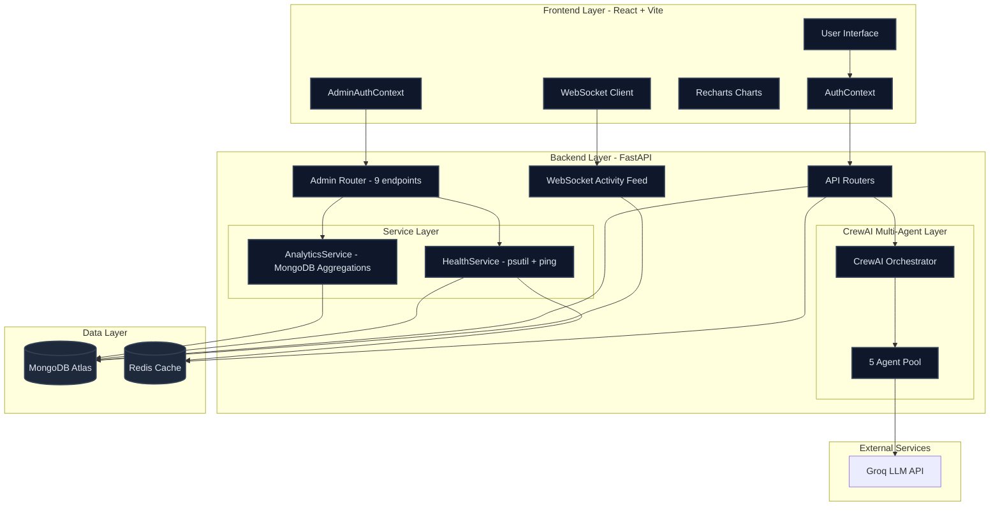

<div align="center">
  
  <h1><b>🚀 Planvix</b></h1>
  <p>
    <strong>Multi-Agent AI Content Strategy OS</strong>
  </p>
  <p>
    <em>Orchestrating 5 Autonomous Agents to Build Your Entire Marketing Strategy</em>
  </p>

  
  
  
  
  
  
</div>

<p align="center">
  <a href="#-about-planvix">🎯 About</a> •
  <a href="#-key-features">✨ Features</a> •
  <a href="#-architecture">🏗️ Architecture</a> •
  <a href="#-admin-intelligence-system">🛡️ Admin System</a> •
  <a href="#-quickstart">⚡ Quickstart</a> •
  <a href="#-pricing">💳 Pricing</a>
</p>

---

## 🎯 About Planvix

**Planvix is not just another wrapper.** It is a **Multi-Agent Operating System** that decomposes the complex task of content strategy into a pipeline of specialized autonomous agents, backed by a full **Enterprise SaaS Admin Intelligence System** for operators.

Unlike generic tools that give you a single "Answer," Planvix employs a **team of 5 expert agents** (Psychology, Trends, SEO, Strategy, ROI) working in sequence to build a cohesive, data-backed executable plan.

**Perfect for:**

- 🎬 **Content Creators** - Scaling from 0 to 1 consistently.
- 🚀 **Founders** - Automating the CMO role.
- 🏢 **Agencies** - Delivering premium strategies in minutes, not weeks.

---

## ✨ Key Features

| Feature                          | Description                                                                                         |
| :------------------------------- | :-------------------------------------------------------------------------------------------------- |
| **🤖 Multi-Agent Orchestration** | 5 autonomous agents collaborating sequentially (Persona → Trends → Traffic → Synthesis → ROI).      |
| **🧠 Deep Psychology**           | **Persona Agent** builds detailed avatars with pain points, triggers, and aspirations.              |
| **📈 Trend Sniper**              | **Trend Agent** identifies real-time market gaps and viral hook angles.                             |
| **🔍 SEO Architecture**          | **Traffic Agent** extracts high-volume keywords and hashtag stacks.                                 |
| **📅 Tactical Blueprint**        | **Synthesis Agent** generates a 30-day execution calendar and content pillars.                      |
| **💰 ROI Prediction**            | **ROI Agent** forecasts traffic lift, engagement boost, and reach estimates.                        |
| **🛡️ Enterprise Admin**          | Full Admin Intelligence System with real-time WebSocket feed, MongoDB analytics, health monitoring. |
| **📊 Analytics Engine**          | MRR, ARPU, Churn Rate, User Growth, Tier Distribution — all from live MongoDB aggregations.         |
| **⚡ Real-time Activity**        | WebSocket-powered live activity feed: user signups, strategy events, admin actions.                 |
| **🔒 JWT Admin Auth**            | Dedicated admin JWT (8h sessions, `role:admin` claim), separate from user auth.                     |
| **📈 Recharts Dashboards**       | AreaCharts, PieCharts, BarCharts, animated CountUp KPI cards, sparklines.                           |

---

## 🏗️ Architecture

Planvix follows a modular **N-Tier Architecture** with a dedicated Admin Intelligence layer:



---

## 🛡️ Admin Intelligence System

A production-grade SaaS admin dashboard comparable to Stripe/Vercel dashboards.

### Admin Login

```
POST /api/admin/login
Body: { "secret": "your_admin_secret" }
Response: { "access_token": "eyJ...", "token_type": "bearer" }
```

Navigate to `http://localhost:5173/admin-login` and enter your `ADMIN_SECRET`.

### Dashboard Tabs

| Tab                 | What it shows                                                                       |
| ------------------- | ----------------------------------------------------------------------------------- |
| **Overview**        | 8 KPI cards (MRR, Users, Strategies, ARPU, Churn, Tier counts) + 4 Recharts charts  |
| **Users**           | Server-side search/filter/pagination, per-user tokens & revenue, CSV export         |
| **Revenue**         | MRR trend, ARPU, churn, industry revenue breakdown, tier breakdown with ₹ revenue   |
| **AI Intelligence** | Total tokens, requests, cost estimate, daily usage chart, most active industry/mode |
| **Live Activity**   | Real-time WebSocket event feed, notification bell, persisted admin_logs             |
| **System Health**   | MongoDB/Redis latency, CPU/memory (psutil), uptime, overall status banner           |

### WebSocket Activity Feed

Events broadcast automatically on: User signup → Strategy generated → Strategy deleted → Admin login

```
ws://localhost:8000/ws/admin/activity
```

---

## ⚡ Quickstart

Get Planvix running in **under 60 seconds**:

### 1️⃣ Clone Repository

```bash
git clone https://github.com/ayush-lakhani/stratify-ai.git
cd stratify-ai
```

### 2️⃣ Backend Setup

_Requires Python 3.11+_

```bash
cd backend
python -m venv venv
# Windows: venv\Scripts\activate
# Mac/Linux: source venv/bin/activate

pip install -r requirements.txt
cp .env.example .env
# Edit .env — set MONGODB_URL, GROQ_API_KEY, JWT_SECRET_KEY, ADMIN_SECRET
python run.py
```

### 3️⃣ Frontend Setup

```bash
cd frontend
npm install
npm run dev
```

### 4️⃣ Launch

| URL                                 | Purpose                |
| ----------------------------------- | ---------------------- |
| `http://localhost:5173`             | Main app (user-facing) |
| `http://localhost:5173/admin-login` | Admin dashboard login  |
| `http://localhost:8000/docs`        | FastAPI Swagger UI     |

---

## 🛠️ Tech Stack

<div align="center">

### Frontend


### Backend


### Data & AI


</div>

---

## 🔧 Environment Variables

```bash
# .env (backend)
MONGODB_URL=mongodb+srv://...
GROQ_API_KEY=gsk_...
JWT_SECRET_KEY=your-super-secret-key-change-in-production
ADMIN_SECRET=your-admin-secret          # Used to log into /admin-login
REDIS_URL=redis://localhost:6379
PROJECT_NAME=Planvix
VERSION=2.0.0
RATE_LIMIT_PER_MINUTE=30
```

---

## 💳 Pricing

| Tier              | Strategies/Month | Price       | Features                                    |
| :---------------- | :--------------- | :---------- | :------------------------------------------ |
| **🆓 Starter**    | 3                | ₹0          | Core Agents, History Access                 |
| **⭐ Pro**        | Unlimited        | **₹299/mo** | All Agents, Priority Queue, ROI Predictions |
| **🏢 Enterprise** | Custom           | **₹999/mo** | White-label, API Access, Team Seats         |

---

## 📄 License

This project is licensed under the **MIT License**.

---

<div align="center">
  <h3>⚡ LLaMA 3.3 70B • 📊 Enterprise Admin • 🇮🇳 Made in India</h3>
  <p><strong>Developed by Ayush Lakhani</strong></p>
</div>
